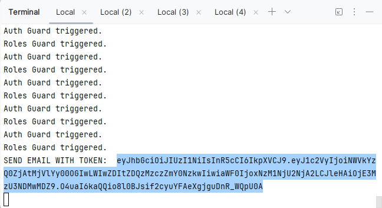
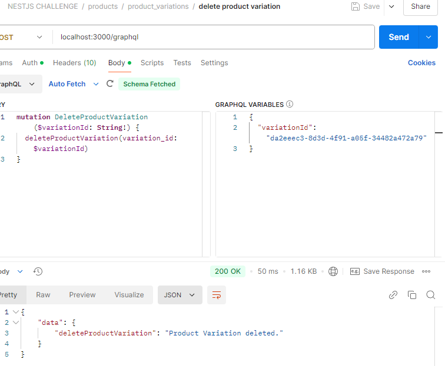

# nestjs-challenge

### Build your tiny API store.
You can choose the target of your business, be creative!.
**Examples:** snack store, pet store, drug store.

## Technical Requirements
* ✅ PostgreSql
  * Kysely / Drizzle
  * ✅ Prisma
* ✅ NestJS
* ✅ Typescript
* ✅ Prettier
* ✅ Eslint
Interactive Coverage Report : [https://ezrillex.github.io/nestjs-challenge/coverage/lcov-report/](https://ezrillex.github.io/nestjs-challenge/coverage/lcov-report/)

## Requirements to Run
1. The following constants on the .env file. A sample file is included.
   - DATABASE_URL
   - JWTCONSTANT
   - CLOUDINARY_CLOUD_NAME
   - CLOUDINARY_API_KEY
   - CLOUDINARY_API_SECRET
   - STRIPE_SHAREABLE_KEY
   - STRIPE_SECRET_KEY
   - STRIPE_WEBHOOK_SIGNING_SECRET
   - AUTO_ROLE (roles can be set by writing (admin/manager) at start of email)
2. Run prisma migrations.
3. npm run start:dev
4. Stripe CLI to trigger payment confirmation. 
5. ngrok to route to the webhook. And setup stripe to send event succeeded and fail to there. 
   - <ngrok link>/payments/webhook
   - use command:
     - ngrok http http://localhost:3000
   - link looks like https://some-id.ngrok-free.app/

## Mandatory Features
1. ✅ Authentication endpoints 
   - ✅sign up
     - Create an account with emails like: customer@gmail.com, admin@gmail.com, manager@gmail.com.
     - 
   - ✅sign in
     - Login with the 3 accounts and set the tokens of the parent folder.
     - 
     - 
   - ✅sign out
     - To logout specify the bearer token, the guard will make sure its you trying to logout. Make sure to login again if you try this.
     - 
   - ✅forgot
     - To request a reset provide an email.
     - 
     - Next copy the token from the server console. (Sending it was extra points😅)
     - 
   - ✅reset password
     - To reset provide the token we got in the previous step. With new passwords.
     - 
2. ✅ List products with pagination
   - Page 1 (specified page size of 3 and fewer fields to fit screenshot)
   - 
   - Page 2
   - 
3. ✅ Search products by category
    - First we want to create a category
    - 
    - With that new id we add it to a product. 
    - 
    - Now we can use the List product endpoint with the category as a filter to get results of only that category. 
    - 
4. ✅ Add 2 kinds of users (Manager, Client)
    - This is an enum.
    - 
5. As a Manager I can:
    * ✅ Create products
      * Note how we can also create nested variation in one go. At least one is required. 
      * 
      * As we are a Wallet Shop, we have variations, we can create more like so.
      * 
      * result:
      * 
    * ✅ Update products
      * Using the id we got in create we can update the fields of the product.
      * 
      * We can use the get one product to see our changes.
      * 
      * As we are a Wallet Shop, we have variations, we can update them like so.
      * 
      * result:
      * 
    * ✅ Delete products
      * We create one to delete
      * 
      * Delete it
      * 
      * check if we can get a deleted one
      * 
      * Same goes for variations. 
      * 
      * Let's delete the green one.
      * 
      * result
      * 
    * ✅ Disable products 
      * As shown in update simply pass "is_published" = false to toggle it in the customer facing frontend. Managers are allowed to get disabled ones. 
      * 
    * ✅ Show clients orders 
      * I have to provide a client id. The endpoint checks for manager role so we sent that token. And we can get the orders a user has. 
      * 
    * ✅ Upload images per product.
      * We need to pass the variation that we are uploading to, and the base 64. 
      * 
      * result
      * 
      * this is the image coming from that link!  
6. As a Client I can:
    * ✅ See products
      * Same as list with pagination. Clients get is_published = false products filtered from this query. 
    * ✅ See the product details
      * 
    * ✅ Buy products
      * With a product added below we can do a purchase by creating an order. 
      * 
    * ✅ Add products to cart
      * We pass the product variation we want to add to cart, and the amount of items.
      * 
    * ✅ Like products
      * We pass the variation we want to like. 
      * 
      * We can get what we liked 
      * 
    * ✅ Show my order
      * We can see all our orders
      * 
      * Or a specific one
      * 
7. ✅ The product information(included the images) should be visible for logged and not logged users. 
   - The field is available for both, and link is not private check out the image here:   
8. ✅ Stripe Integration for payment (including webhooks management)
   - Now that we have the order, the frontend can send us the id and the amount we want to charge to build the payment intent. We return some information so that the front can add the payment method. 
   - 
   - So because we dont have a front we use this endpoint with the admin token to simulate that we add a payment method. As we see now the stripe intent only needs to be confirmed. 
   - 
   - So to do that we need the Stripe CLI, but first make sure to point stripe and start ngrok so that we can receive the hook. 
   - Now use the stripe cli with the following command to trigger the confirmation. (Here we pass the id we got from the create payment call)
     - .\stripe.exe payment_intents confirm pi_3QcCSJP0YP2CvfqE0UDqhK5p
   - 
   - This triggers the hook, and we can check in the stripe dashboard our response. 
   - 
   - Finally, we go to query the payment information and observe the status has been updated.
   - 
   - We go see the order object and observe the status has also propagated here. 
   - 

## Mandatory Implementations
- ✅ Schema validation for environment variables
  - 
- ✅ Usage of global exception filter
  - On main.ts : app.useGlobalFilters(new GlobalExceptionFilter(httpAdapter));
  - Filter at: src/common/filters/global-exception.filter.ts
- ✅ Usage of guards, pipes (validation).
  - Available at: src/auth/guards/
  - Usage of pipes in parameters
  - Usage of class-validator in DTOs. 
  - In GQL mainly used @Field(()=> ClassToValidate, {nullable: true})
- ✅ Usage of custom decorators
  - Available at: src/common/decorators/
- ✅ Configure helmet, cors, rate limit (this last one for reset password feature)
  - Cors:
    - on main.ts: app.enableCors();
  - Helmet: 
    - 
  - Rate Limit: 
    - On AuthModule: ThrottlerModule.forRoot([{ ttl: 60000, limit: 100 }]),
    - On Reset Endpoint:   
      - @Throttle({ default: { limit: 3, ttl: 60000 } })
      - @UseGuards(ThrottlerGuard)

## Extra points 😞
* ❎ Implement resolve field in graphQL queries (if apply)
* ❎ When the stock of a product reaches 3, notify the last user that liked it and not purchased the product yet with an email.
  Use a background job and make sure to include the product's image in the email.
* ❎ Send an email when the user changes the password
* ❎ Deploy on Heroku

## Notes:

Requirements to use Rest:
* ✅ Authentication endpoints (sign up, sign in, sign out, forgot, reset password)
* ✅ Stripe Integration for payment (including webhooks management)

  * I understand this implies all payment related apis are REST. This is how I developed it. (Webhook, Create payment intent, and get order payments.)
  
- Requirements to use Graph:
* ✅ The ones not included in the block above
